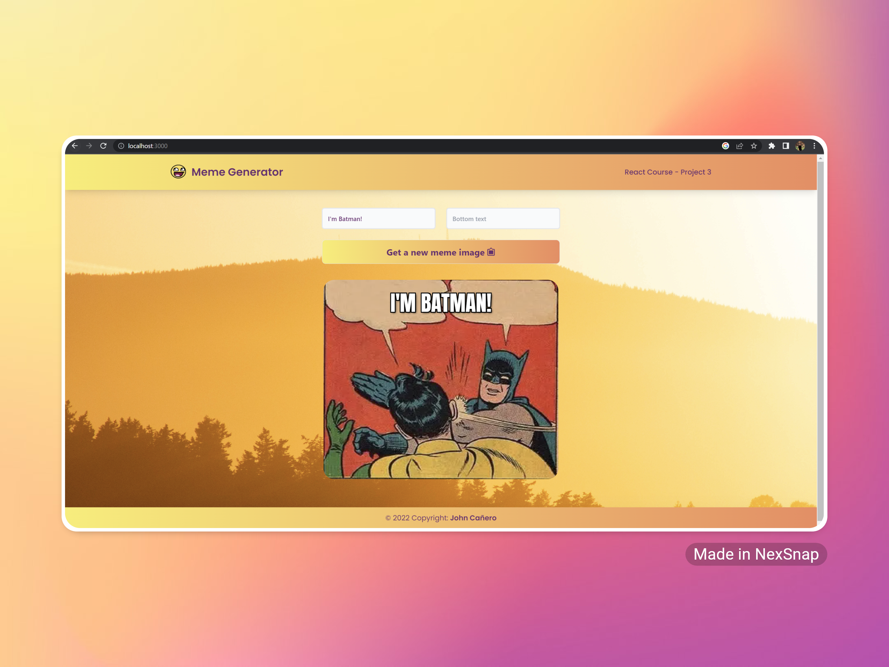
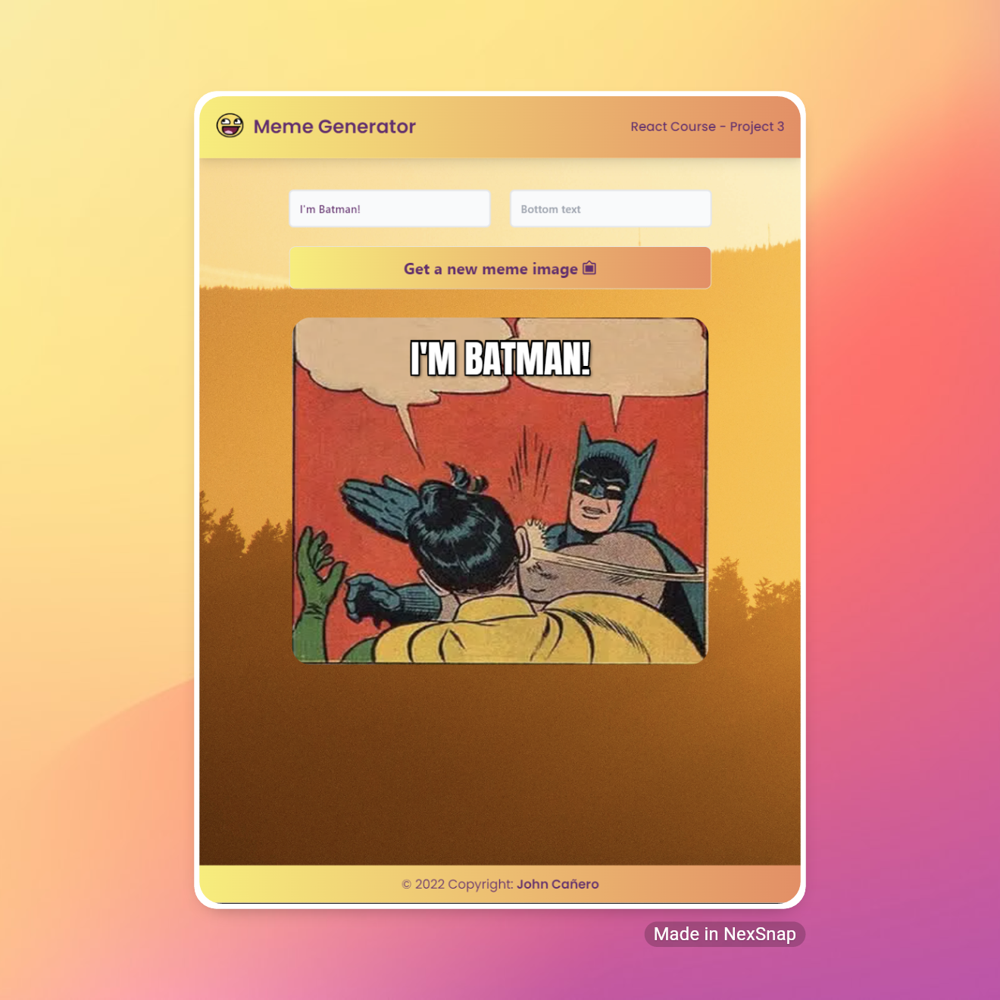
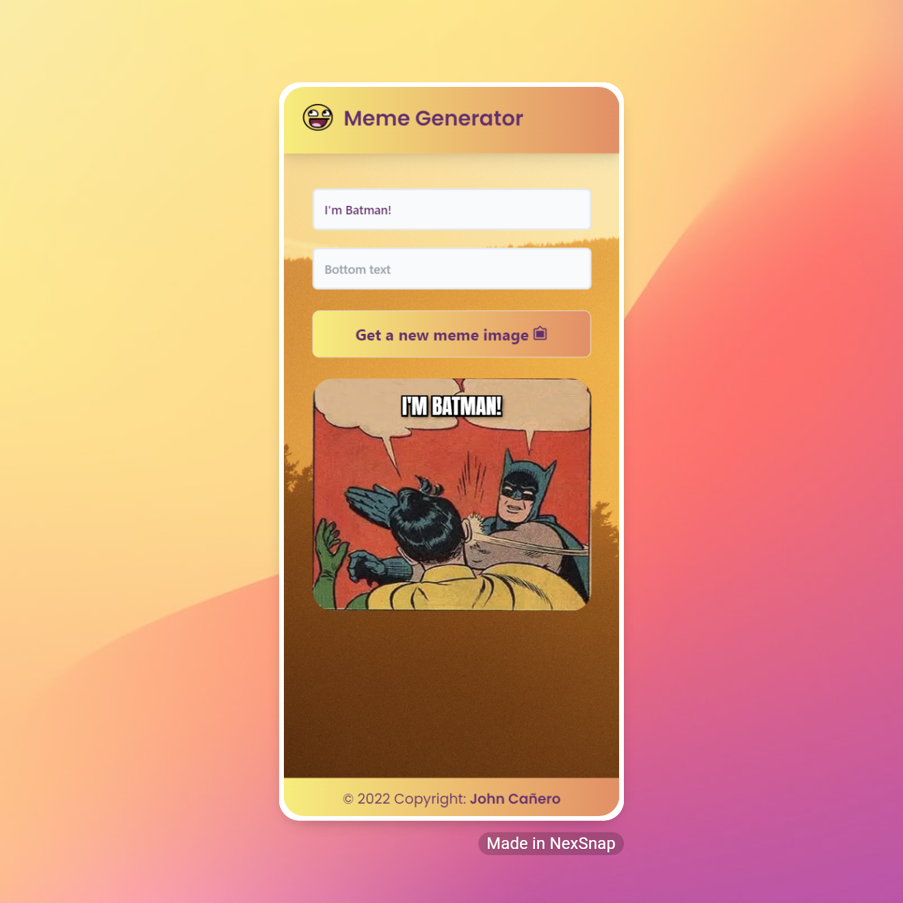
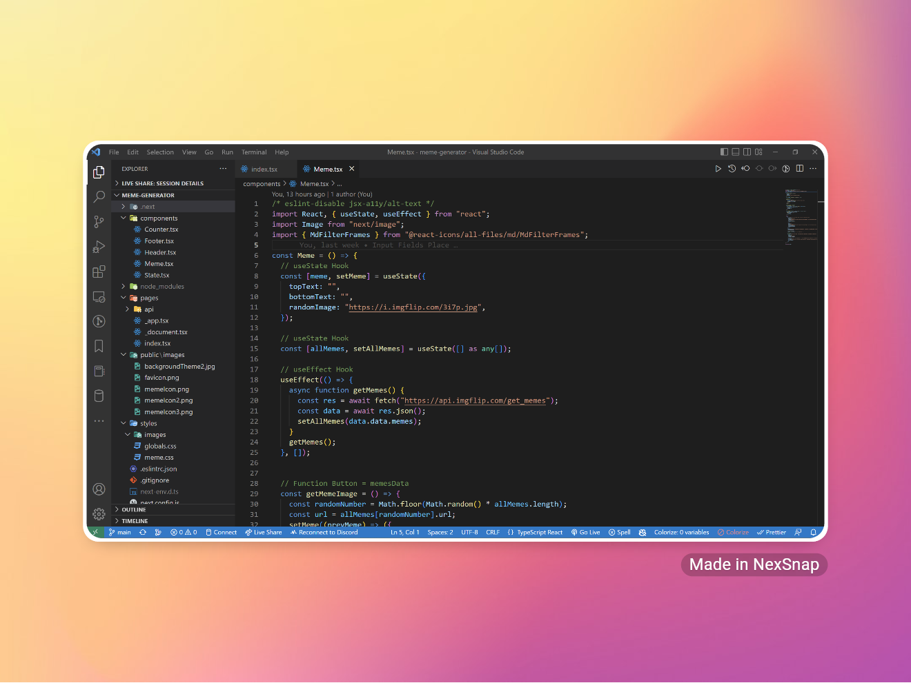

<!-- markdownlint-configure-file {
  "MD013": {
    "code_blocks": false,
    "tables": false
  },
  "MD033": false,
  "MD041": false
} -->

  

# Meme GeneratorPage

This is the Meme Generator Application Page made by Next Js, Typescript and
Tailwind CSS.

Let's take a break and have a Meme!

## Website

🖥️ [https://meme-generator-rose-by-johncanero.vercel.app/]

✍️ Project by John Cañero

## Responsive Design

🪟: [Desktop - Tablet - Mobile]

